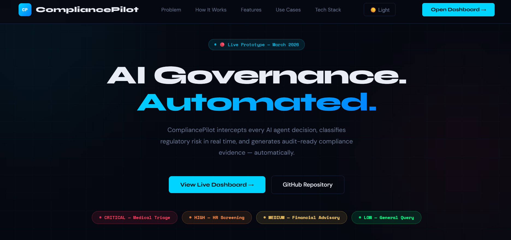
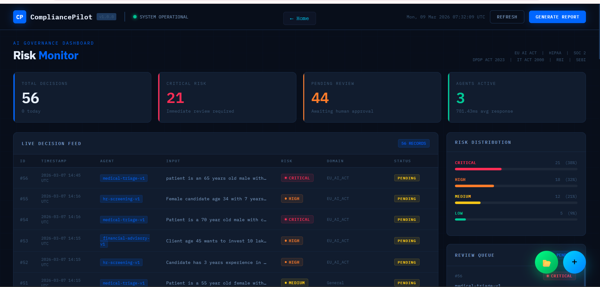
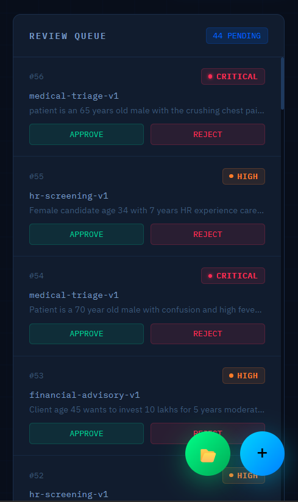
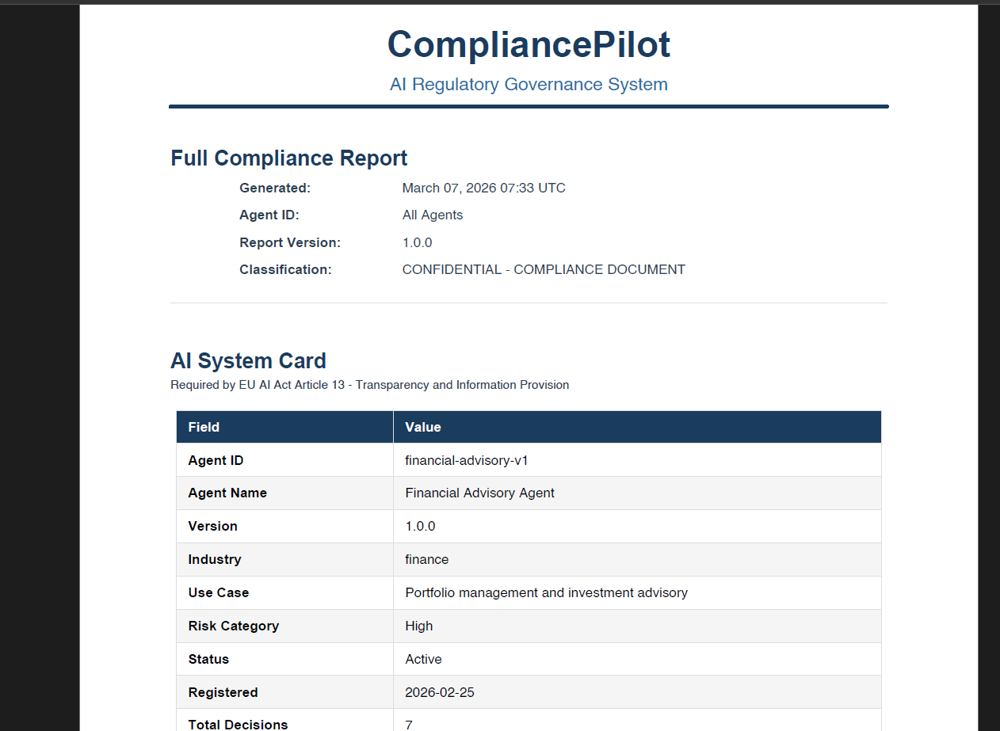

# CompliancePilot 
### AI Regulatory Governance Layer — Automated Compliance for Every AI Decision

[](https://compliancepilot.onrender.com)
[](https://compliancepilot.onrender.com/static/index.html)
[](https://compliancepilot.onrender.com/api/docs)
[](https://github.com/kdeepak2001)

---

## 📸 Screenshots

###  Landing Page


###  Live Dashboard


###  Human Review Queue


###  Auto-Generated PDF Compliance Report


---

##  The Problem

Every company deploying AI agents in 2026 faces the same crisis:

- AI agents are making autonomous decisions — recommending treatments, approving transactions, scoring candidates
- **Zero structured documentation** of how those decisions were made
- **EU AI Act** enforcement deadline: August 2026
- **India DPDP Act 2023** active — penalties up to **Rs 250 crores per breach**
- No standardized tooling exists at the agent-decision level

**CompliancePilot fills this gap.**

---

##  What CompliancePilot Does

CompliancePilot is a three-layer AI middleware system:

| Layer | What It Does |
|-------|-------------|
|  Decision Interception | Captures every AI agent decision — input, output, timestamps, tool calls — automatically |
|  Regulatory Classification | Gemini 2.5 Flash classifies each decision against 8+ regulatory frameworks in under 5 seconds |
|  Compliance Evidence | Auto-generates audit-ready PDF reports — AI System Card, Audit Trail, Human Oversight Record |

---

##  Live Demo

> **Try it yourself — no login required**

 **Landing Page:** https://compliancepilot.onrender.com

 **Live Dashboard:** https://compliancepilot.onrender.com/static/index.html

 **API Docs:** https://compliancepilot.onrender.com/api/docs

### How to Demo
1. Click **+** button → Select Medical Triage Agent → Type a patient scenario → Click Generate AI Output → Submit for Compliance Review → Watch Critical risk classification appear in live feed
2. Click **📂** button → Upload sample CSV → Watch bulk decisions classified with progress bar
3. Click **Generate Report** → Download professional 4-page PDF compliance report
4. Approve a Critical decision in Review Queue → See it logged permanently with reviewer ID and justification

---

## 🏛️ Regulatory Frameworks Covered

| Framework | Coverage |
|-----------|---------|
| 🇪🇺 EU AI Act 2024 | Articles 9, 13, 14, 16 — Annex III high-risk classification |
|  HIPAA | Section 164.312 Audit Controls — Minimum Necessary Standard |
|  SOC 2 Type II | Processing Integrity, Confidentiality, Availability criteria |
| 🇮🇳 DPDP Act 2023 | Section 8 and 9 — Rules notified November 2025 |
|  IT Act 2000 | Sections 43, 66, 72A — Data protection obligations |
|  RBI AI Guidelines 2024 | Responsible AI in Banking — KYC and credit decisions |
|  SEBI AI Circular 2023 | Algorithmic trading oversight and audit trail |
|  GDPR | Articles 5, 6, 9, 22, 25 — Automated decision making rights |

---

## 🏥 Demo Scenarios

### Scenario 1 — Medical Triage Agent
```
Input:          Patient is a 65 year old male with crushing chest pain and shortness of breath
AI Output:      Immediate ECG recommended. Possible acute coronary syndrome. Cardiology consult required.
Classification: CRITICAL — EU AI Act Annex III + HIPAA Section 164.312
Action:         Mandatory human review triggered automatically
```

### Scenario 2 — Financial Advisory Agent
```
Input:          Transaction of Rs 85 lakhs flagged — no senior management authorization exists
AI Output:      High risk financial discrepancy. Immediate escalation to CFO required.
Classification: CRITICAL — SOC 2 Processing Integrity + RBI AI Guidelines 2024
Action:         Escalated to senior auditor queue for approval
```

### Scenario 3 — HR Screening Agent
```
Input:          Female candidate rejected automatically by AI due to career gap of 8 months
AI Output:      Candidate meets technical requirements. Career gap requires manual review.
Classification: HIGH — EU AI Act Article 9 + DPDP Act 2023
Action:         Potential bias documentation flagged for compliance review
```

---

##  System Architecture
```
AI Agent Output
      ↓
Agent Wrapper SDK (intercepts — zero code changes needed)
      ↓
FastAPI POST /api/decisions/log
      ↓
PII Sanitizer (masks Aadhaar, PAN, phone, email)
      ↓
Gemini 2.5 Flash (classifies risk tier + regulatory domain)
      ↓
Supabase PostgreSQL (immutable audit log)
      ↓
Dashboard + Review Queue + PDF Reports
```

---

## 🛠️ Tech Stack

| Component | Technology |
|-----------|-----------|
| Language | Python 3.11 |
| Backend | FastAPI + Uvicorn |
| AI Engine | Google Gemini 2.5 Flash |
| Database (Local) | SQLite |
| Database (Cloud) | Supabase PostgreSQL |
| ORM | SQLAlchemy |
| Frontend | HTML + TailwindCSS CDN + Alpine.js |
| PDF Reports | ReportLab |
| Deployment | Render.com |
| CI/CD | GitHub Actions |
| Version Control | GitHub |

**Total Infrastructure Cost: $0**

---

##  Proof of Work

### Classification Results (Live Data)

| Risk Tier | Count | Percentage | Regulatory Domain |
|-----------|-------|-----------|------------------|
| 🔴 Critical | 10 | 31.2% | EU AI Act, HIPAA, SOC 2 |
| 🟠 High | 7 | 21.9% | EU AI Act, SEBI |
| 🟡 Medium | 10 | 31.2% | General, RBI |
| 🟢 Low | 5 | 15.6% | General |
| **Total** | **32** | **100%** | |

### Auto-Generated Report Contains
- ✅ AI System Card — Required by EU AI Act Article 13
- ✅ Decision Audit Trail — Required by HIPAA Section 164.312
- ✅ Human Oversight Record — Required by EU AI Act Article 14
- ✅ Risk Assessment Summary — Required by EU AI Act Article 9
- ✅ 12 Regulatory Citations — Across all covered frameworks

---

## 🔐 Security Features

| Feature | Implementation |
|---------|---------------|
| PII Masking | Regex-based detection — Aadhaar, PAN, phone, email masked before external API |
| Immutable Logs | Write-once database records — no edit or delete through application interface |
| Environment Variables | All API keys in .env — never hardcoded |
| Privacy by Design | GDPR Article 25 — data minimization at architecture level |
| Secure Headers | CORS middleware with controlled origins |

---

## 🚀 Run Locally
```bash
# 1. Clone the repository
git clone https://github.com/kdeepak2001/CompliancePilot.git
cd CompliancePilot

# 2. Create virtual environment
python -m venv venv
venv\Scripts\activate        # Windows
source venv/bin/activate      # Mac/Linux

# 3. Install dependencies
pip install -r requirements.txt

# 4. Set environment variables
cp .env.example .env
# Edit .env and add:
# GEMINI_API_KEY=your_key_here
# DATABASE_URL=your_supabase_url (optional - uses SQLite by default)

# 5. Run the application
python main.py

# 6. Open in browser
# Landing Page:  http://localhost:8000
# Dashboard:     http://localhost:8000/static/index.html
# API Docs:      http://localhost:8000/api/docs
```

---

## 📁 Project Structure
```
CompliancePilot/
├── backend/
│   ├── api/
│   │   ├── main.py              # FastAPI app + all API endpoints
│   │   └── schemas.py           # Pydantic request/response models
│   ├── classification/
│   │   └── engine.py            # Gemini 2.5 Flash classification engine + PII masking
│   ├── database/
│   │   └── models.py            # SQLAlchemy models + database setup
│   └── reports/
│       └── generator.py         # ReportLab PDF compliance report generator
├── frontend/
│   ├── index.html               # Live real-time dashboard
│   └── landing.html             # Product landing page
├── screenshots/
│   ├── landing.png              # Landing page screenshot
│   ├── dashboard.png            # Dashboard screenshot
│   ├── review.png               # Review queue screenshot
│   └── report.png               # PDF report screenshot
├── main.py                      # Application entry point
├── requirements.txt             # Python dependencies
├── .env.example                 # Environment variables template
├── Dockerfile                   # Container configuration
└── render.yaml                  # Render.com deployment config
```

---

## 🗺️ Roadmap

- [ ] RAGAS evaluation metrics for classification accuracy measurement
- [ ] Role-based access control — Compliance Officer / Auditor / Admin
- [ ] RAG integration for custom company compliance policies
- [ ] Multi-tenant SaaS architecture
- [ ] Natural language query interface for compliance officers
- [ ] Real-time regulatory update feed as laws evolve
- [ ] Slack and Teams notifications for Critical decisions
- [ ] CCPA, FDA 21 CFR Part 11, FINRA framework support

---

### 🚀 Future Upgrades

| Feature | Description | Priority |
|---------|-------------|----------|
| 🧠 RAGAS Evaluation | Measure classification accuracy — faithfulness, relevance, precision | High |
| 🔐 Role-Based Access | Compliance Officer / Auditor / Admin with separate views | High |
| 📚 RAG Policy Engine | Upload company-specific compliance policies — system learns from them | High |
| 🔔 Real-Time Alerts | Slack and Teams notifications for Critical decisions instantly | Medium |
| 🌍 More Frameworks | CCPA, FDA 21 CFR Part 11, FINRA, ISO 42001 support | Medium |
| 🏢 Multi-Tenant SaaS | Multiple companies on one instance with isolated data | Medium |
| 💬 Natural Language Query | Ask compliance questions — "Show all Critical HR decisions last month" | Low |
| 📡 Regulatory Feed | Auto-updates classification rules as new regulations are published | Low |


```
---

## 👤 Author

<div align="center">

### **Kalava Deepak**
#### ECE Graduate 2024 | AI Developer | Open to Opportunities

[](https://github.com/kdeepak2001)
[](https://linkedin.com/in/kalava-deepak)
[](mailto:kalavadeepak2001@gmail.com)
[](https://compliancepilot.onrender.com)

---

> *"I built CompliancePilot to solve a real enterprise problem — not just to learn a framework.
> Every component was designed with production readiness and regulatory accuracy in mind."*

</div>
> Built CompliancePilot from scratch in 4 weeks using Python, FastAPI, Gemini 2.5 Flash, and open source tools. Total infrastructure cost: $0.

| | |
|--|--|
| 🌐 Live Demo | https://compliancepilot.onrender.com |
| 💼 LinkedIn | https://linkedin.com/in/kalava-deepak |
| 🐙 GitHub | https://github.com/kdeepak2001 |
| 📧 Email | kalavadeepak2001@gmail.com |

**Open to roles in:** AI Governance | Responsible AI | RegTech | AI Product Management | GenAI Engineering
📍 Bangalore, India | ⚡ Immediate Joiner | 🌏 Open to Relocation

---

## ⚠️ Disclaimer

This system is a compliance evidence aid only and does not constitute legal, medical, or financial advice. Classifications are AI-assisted recommendations requiring human validation for High and Critical risk decisions. Organizations must consult qualified legal counsel for final compliance determinations in their jurisdiction.

For Indian operations: DPDP Act 2023 Rules notified 14 November 2025. Data Protection Board operational. Maximum penalty Rs 250 crores per breach.

---

*CompliancePilot v1.0.0 — March 2026 — Built by Kalava Deepak*
